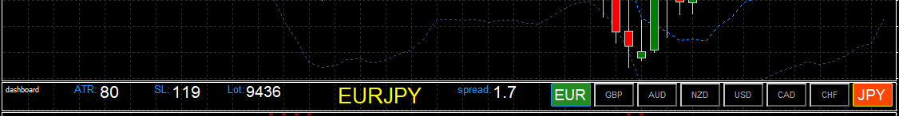

# NNFX-Currency-Dashboard (Version 0.0.1)
MT4 Indicator, Using 8 currency buttons to change to 28 currency pairs. Also displays some current stats commonly used in NNFX framework such as ATR, Stop Loss, and 1% Risk Lot Size. 

### Release History

1. Version 0.0.1
    1. This is the initial release and there are some known issues already.
        1. Issue: Does NOT work well when open in more than one Chart. This should be fixed in later version. Until then please only use on one chart at a time.
        1. Issue: Color scheme is hard coded to work with black background. If your charts use white background, the white text will be a bit like disappearing ink.
        1. Issue: Only 8 major currencies are supported. Plus the design does not make it easy to add more.

